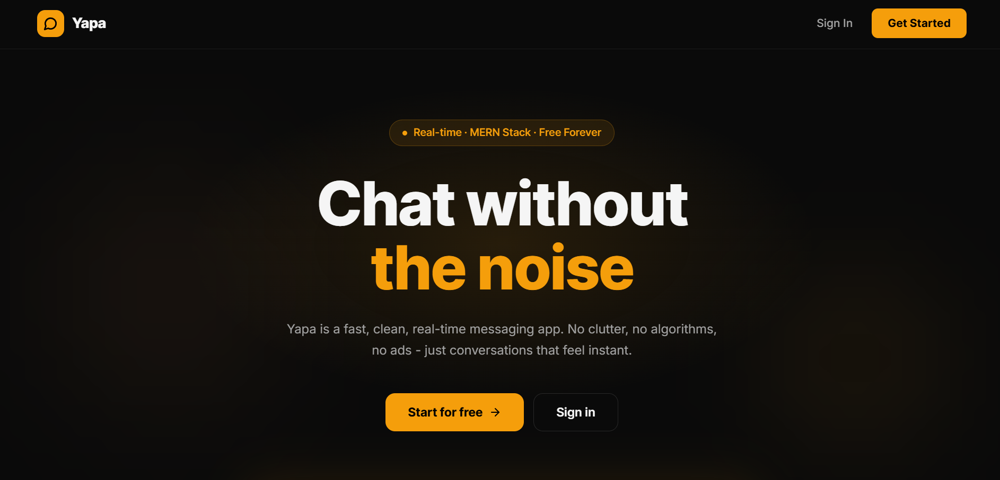

<div align="center">


# Yapa

### Real-time MERN chat app — messages, reactions, and presence, delivered instantly

[](https://yapa-sand.vercel.app)
[](https://yapa-fxe2.onrender.com)
[](https://react.dev)
[](https://nodejs.org)
[](https://socket.io)
[](LICENSE)

[Features](#-features) · [Tech Stack](#-tech-stack) · [Getting Started](#-getting-started) · [API Reference](#-api-reference) · [Deployment](#-deployment)

</div>

---

## 📸 Preview



---

## ✨ Features

| Feature | Description |
|---|---|
| 🔐 **JWT Authentication** | Signup/login with HTTP-only cookie sessions — no third-party auth |
| ⚡ **Real-Time Messaging** | Instant bidirectional messaging via Socket.io with optimistic UI updates |
| 😄 **Emoji Reactions** | React to any message; reactions sync live across both clients |
| 🗑️ **Message Deletion** | Soft-delete your own messages; deleted state propagates in real time |
| ✍️ **Typing Indicators** | Animated dots when the other person is typing, debounced at 1.5s |
| 🔴 **Unread Badges** | Per-conversation unread counts, cleared automatically on open |
| 🟢 **Online Presence** | Live online/offline status tracked per socket connection |
| 📸 **Image Sharing** | Upload and send images, stored via Cloudinary CDN |
| 🔔 **Sound Effects** | Notification and keystroke audio with a per-session toggle |
| 📧 **Welcome Emails** | Transactional email on account creation via Resend |
| 🚦 **Rate Limiting** | API abuse prevention powered by Arcjet |
| 📱 **Responsive UI** | Works across desktop and mobile screen sizes |

---

## 🛠 Tech Stack

**Frontend**
- [React.js](https://react.dev) — UI library
- [Zustand](https://zustand-demo.pmnd.rs) — lightweight global state management
- [Tailwind CSS](https://tailwindcss.com) + [DaisyUI](https://daisyui.com) — styling
- [Socket.io-client](https://socket.io) — real-time events
- [Axios](https://axios-http.com) — HTTP client
- [Vite](https://vitejs.dev) — build tool

**Backend**
- [Node.js](https://nodejs.org) + [Express.js](https://expressjs.com) — REST API server
- [MongoDB](https://mongodb.com) + [Mongoose](https://mongoosejs.com) — database & ODM
- [Socket.io](https://socket.io) — WebSocket server
- [bcryptjs](https://github.com/dcodeIO/bcrypt.js) — password hashing
- [jsonwebtoken](https://github.com/auth0/node-jsonwebtoken) — JWT auth
- [Cloudinary](https://cloudinary.com) — image storage & CDN
- [Resend](https://resend.com) — transactional email
- [Arcjet](https://arcjet.com) — rate limiting & bot protection

---

## 🚀 Getting Started

### Prerequisites

- Node.js `>=20.0.0`
- MongoDB Atlas account (or local MongoDB)
- [Cloudinary](https://cloudinary.com) account
- [Resend](https://resend.com) account
- [Arcjet](https://arcjet.com) account

### 1. Clone the repository

```bash
git clone https://github.com/adityack477/yapa.git
cd yapa
```

### 2. Configure backend environment

Create a `.env` file inside `backend/`:

```env
PORT=3000
MONGO_URI=your_mongodb_connection_string

NODE_ENV=development

JWT_SECRET=your_long_random_secret_here

# Resend — transactional email
RESEND_API_KEY=re_xxxxxxxxxxxx
EMAIL_FROM=hello@yourdomain.com
EMAIL_FROM_NAME=Yapa

# Frontend URL (for CORS and email links)
CLIENT_URL=http://localhost:5173

# Cloudinary — image uploads
CLOUDINARY_CLOUD_NAME=your_cloud_name
CLOUDINARY_API_KEY=your_api_key
CLOUDINARY_API_SECRET=your_api_secret

# Arcjet — rate limiting
ARCJET_KEY=ajkey_xxxxxxxxxxxx
ARCJET_ENV=development
```

### 3. Run the backend

```bash
cd backend
npm install
npm run dev
```

Server starts at `http://localhost:3000`

### 4. Run the frontend

```bash
# in a new terminal, from the project root
cd frontend
npm install
npm run dev
```

App runs at `http://localhost:5173`

---

## 📡 API Reference

### Auth — `/api/auth`

| Method | Endpoint | Description | Auth |
|--------|----------|-------------|------|
| `POST` | `/signup` | Register a new account | ❌ |
| `POST` | `/login` | Login and receive JWT cookie | ❌ |
| `POST` | `/logout` | Clear session cookie | ✅ |
| `GET` | `/check` | Verify current session | ✅ |
| `PUT` | `/update-profile` | Update profile picture | ✅ |

### Messages — `/api/messages`

| Method | Endpoint | Description | Auth |
|--------|----------|-------------|------|
| `GET` | `/contacts` | Get all users (excluding self) | ✅ |
| `GET` | `/chats` | Get users you've chatted with | ✅ |
| `GET` | `/unread/counts` | Get unread message counts per user | ✅ |
| `GET` | `/:id` | Fetch message history with a user | ✅ |
| `POST` | `/send/:id` | Send a message to a user | ✅ |
| `DELETE` | `/:id` | Soft-delete your own message | ✅ |
| `POST` | `/:id/react` | Add or toggle an emoji reaction | ✅ |

### Socket Events

| Event | Direction | Payload | Description |
|-------|-----------|---------|-------------|
| `newMessage` | server → client | `Message` | New incoming message |
| `messageDeleted` | server → client | `{ messageId }` | Message was deleted |
| `reactionUpdated` | server → client | `{ messageId, reactions }` | Reactions changed |
| `getOnlineUsers` | server → client | `string[]` | Updated online user list |
| `typingStart` | client → server | `{ receiverId }` | User started typing |
| `typingStop` | client → server | `{ receiverId }` | User stopped typing |
| `userTyping` | server → client | `{ senderId }` | Someone is typing to you |
| `userStoppedTyping` | server → client | `{ senderId }` | They stopped typing |

---

## 📁 Project Structure

```
yapa/
├── backend/
│   ├── src/
│   │   ├── controllers/
│   │   │   ├── auth.controller.js        # signup, login, logout, updateProfile
│   │   │   └── message.controller.js     # messages, reactions, delete, unread
│   │   ├── middleware/
│   │   │   ├── auth.middleware.js        # JWT verification (REST)
│   │   │   ├── socket.auth.middleware.js # JWT verification (WebSocket)
│   │   │   └── arcjet.middleware.js      # rate limiting
│   │   ├── models/
│   │   │   ├── User.js                   # user schema
│   │   │   └── Message.js                # message schema (reactions, soft-delete)
│   │   ├── routes/
│   │   │   ├── auth.route.js
│   │   │   └── message.route.js
│   │   └── lib/
│   │       ├── socket.js                 # Socket.io server + typing events
│   │       ├── db.js                     # MongoDB connection
│   │       ├── cloudinary.js
│   │       ├── resend.js
│   │       └── env.js                    # validated env vars
│   ├── .env.example
│   └── package.json
│
└── frontend/
    └── src/
        ├── components/
        │   ├── MessageBubble.jsx          # reactions + delete UI
        │   ├── MessageInput.jsx           # typing emit + image upload
        │   ├── ChatContainer.jsx
        │   ├── ChatHeader.jsx             # typing indicator + online status
        │   ├── ChatsList.jsx              # sidebar chats + unread badges
        │   └── ContactList.jsx
        ├── pages/
        │   ├── ChatPage.jsx
        │   ├── LoginPage.jsx
        │   └── SignUpPage.jsx
        ├── store/
        │   ├── useChatStore.js            # messages, reactions, typing, unread
        │   └── useAuthStore.js            # auth + socket connection
        ├── hooks/
        │   └── useKeyboardSound.js
        └── lib/
            └── axios.js
```

---

## 🔑 Key Implementation Details

**Optimistic UI** — Messages appear in the UI immediately with a temp ID before the server responds. On success the placeholder is swapped with the real document; on failure it's rolled back.

**Soft Delete** — Deleted messages set `deletedAt` and clear `text`/`image` fields in MongoDB rather than hard removal. The receiver sees a "Message deleted" placeholder. The socket event `messageDeleted` propagates the state change in real time.

**Reaction Toggle** — A user can only hold one reaction per message at a time. Sending the same emoji again removes it. The full reactions array is broadcast to both participants via `reactionUpdated`.

**Typing Debounce** — `typingStart` is emitted once at the start of a burst of keystrokes. `typingStop` fires 1500ms after the last keystroke via a debounced timeout, preventing excessive socket events.

**Unread Counts** — Computed server-side using a MongoDB aggregation pipeline that groups unread messages (`readAt: null`) by `senderId`. Opening a conversation stamps `readAt` via `updateMany` and clears the badge locally in Zustand.

---

## 🌐 Deployment

| Service | Platform |
|---------|----------|
| Frontend | [Vercel](https://vercel.com) |
| Backend | [Render](https://render.com) |
| Database | [MongoDB Atlas](https://www.mongodb.com/atlas) |

### Render (Backend)

Set **Root Directory** → `backend`, **Build Command** → `npm install`, **Start Command** → `npm start`.

Add these environment variables in the Render dashboard:

| Variable | Value |
|---|---|
| `NODE_ENV` | `production` |
| `PORT` | `3000` |
| `MONGO_URI` | MongoDB Atlas connection string |
| `JWT_SECRET` | Long random secret |
| `CLIENT_URL` | Your Vercel frontend URL |
| `RESEND_API_KEY` | From resend.com |
| `EMAIL_FROM` | Your verified sender address |
| `EMAIL_FROM_NAME` | `Yapa` |
| `CLOUDINARY_CLOUD_NAME` | From Cloudinary dashboard |
| `CLOUDINARY_API_KEY` | From Cloudinary dashboard |
| `CLOUDINARY_API_SECRET` | From Cloudinary dashboard |
| `ARCJET_KEY` | From arcjet.com |
| `ARCJET_ENV` | `production` |

### Vercel (Frontend)

Add this environment variable in the Vercel dashboard:

| Variable | Value |
|---|---|
| `VITE_API_URL` | Your Render backend URL (no trailing slash) |

> **Important:** `CLIENT_URL` on Render must exactly match your Vercel URL, and `VITE_API_URL` must point to your Render URL — these two are what connect the frontend and backend.

---

## 📄 License

MIT © [Aditya Kadam](https://github.com/adityack477)
